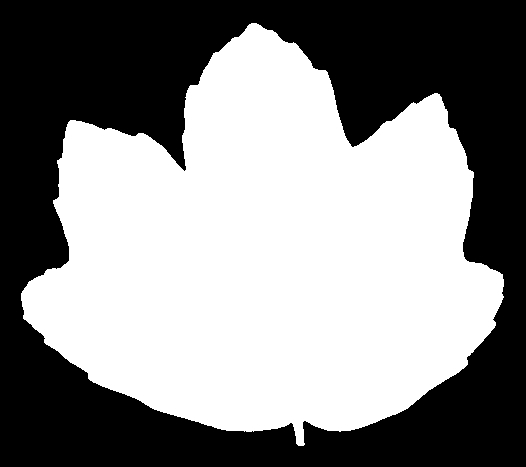

# Kaggle leaf classification competition using transfer learning

There are estimated to be nearly half a million species of plants in the world. Classification of species has been historically problematic and often results in duplicate identifications.
The objective of this playground competition is to use binary leaf images to accurately identify 99 species of plants.

-> Download dataset files from [Kaggle leaf classification competition](https://www.kaggle.com/c/leaf-classification)

There will be train.csv, test.csv, and 1584 images in a folder. We need these CSV files to split images into train and test files.

Images are binary like theses:

I use **transfer learning**. In this method, a pre-trained network (InceptionV3 model) is used as a feature extractor.

Finally, the extracted features are classified with a simple classifier like **SVM** or **logistic regression**.

